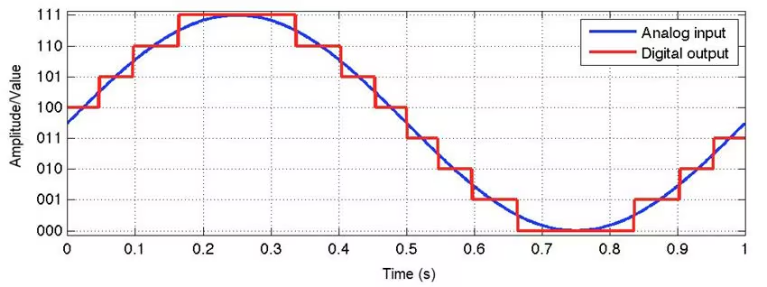
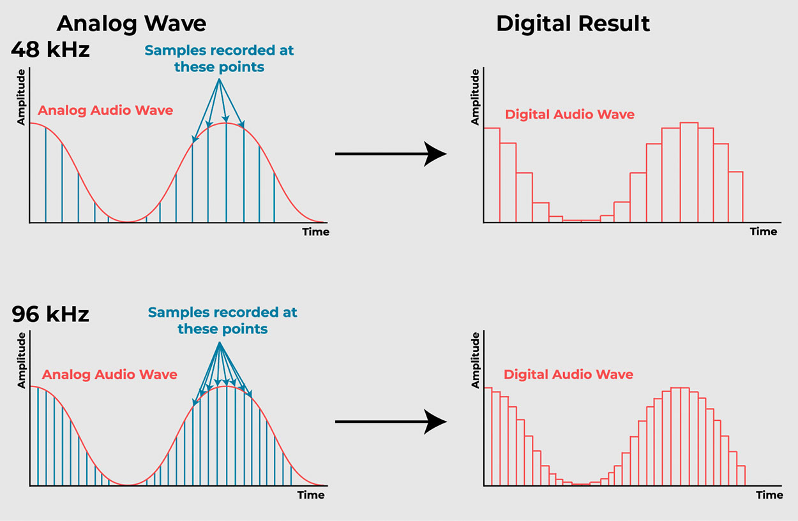

# Practical Audio Applications with Transformer-Based Models

In this post, we’ll explore three practical audio processing techniques using pretrained transformer-based models from [Hugging Face](https://huggingface.co/).

Before diving in, it's important to understand how computers process audio data.

Sound waves are continuous signals, but computers work with discrete values. That’s why we need an analog-to-digital converter (ADC), which samples the waveform to produce a digital representation.



Available at: [Analog-to-digital converters basics](https://www.arrow.com/en/research-and-events/articles/engineering-resource-basics-of-analog-to-digital-converters)

One key property of an ADC is the sampling rate — the number of samples taken per second, typically measured in Hertz (Hz).



Available at: [Sample Rate and Bit Depth in the Digital Audio World](https://woodandfirestudio.com/en/sample-rate-bit-depth/)

Why does this matter? Well, transformer-based audio models are often trained on data with a specific sampling rate. To get the best performance when using these models, your input audio must match that sampling rate.

Now, let's dive into some practical and fun features you can build using transformer-based audio models.

First, install the required libraries (if you're running this in a Jupyter Notebook):
```bash
!pip install transformers huggingface_hub torch datasets soundfile
```
To keep the output clean, let’s suppress the warnings from the Transformers library:

```python
from transformers.utils import logging
logging.set_verbosity_error()
```
## Zero-Shot Audio Classification

The goal here is to classify an audio sample into one of several candidate labels using a transformer-based model — without any fine-tuning. This is known as zero-shot classification. We will use this [ESC-50 dataset](https://huggingface.co/datasets/ashraq/esc50) which contains short environmental sound recordings labeled across 50 different categories.

We’ll load a small sample from the dataset directly from Hugging Face:
```python
from datasets import load_dataset
from IPython.display import Audio as IPythonAudio

# Load a small slice of the ESC-50 dataset
dataset = load_dataset("ashraq/esc50", split="train[0:10]")

# Preview an audio sample
audio_sample = dataset[0]
# Listen to the audio (works fine when using Colab)
IPythonAudio(audio_sample['audio']['array'], rate=audio_sample['audio']['sampling_rate'])
```
The audio sample is a sound of chirping birds. Now, let’s load the [CLAP model](https://huggingface.co/laion/clap-htsat-unfused), which supports zero-shot classification of audio:

```python
from transformers import pipeline
zero_shot_classifier = pipeline(task="zero-shot-audio-classification", model="laion/clap-htsat-unfused")
# Define the candidate labels and run the classifier
candidate_labels = ['dog', 'water_drop', 'chirping_birds', 'human', 'vacuum_cleaner']
zero_shot_classifier(audio_sample["audio"]["array"], candidate_labels=candidate_labels)

[{'score': 0.9997683167457581, 'label': 'chirping_birds'},
 {'score': 0.00010584398842183873, 'label': 'dog'},
 {'score': 9.18600635486655e-05, 'label': 'vacuum_cleaner'},
 {'score': 1.7218202629010193e-05, 'label': 'human'},
 {'score': 1.673607766861096e-05, 'label': 'water_drop'}]
```

It correctly predicted the label! However, we didn’t verify the sampling rates — which is important. The input audio should match the sampling rate the model was trained on to ensure accurate results.

``` python
# Check the model's expected sampling rate
sr_model = zero_shot_classifier.feature_extractor.sampling_rate  # e.g., 48000

# Check the sampling rate of our audio sample
sr_sample = audio_sample['audio']['sampling_rate']  # e.g., 44100
```

Since the rates are different, let’s resample the audio to match the model’s expected input:

```python
from datasets import Audio

# Resample audio to match the model's expected rate
dataset = dataset.cast_column("audio", Audio(sampling_rate= 48_000))
audio_sample = dataset[0]
```

When changing the sampling rate, you're altering the audio's frequency. This affects its duration, since frequency and time are inversely related.

Nice! You’ve just run your first zero-shot audio classification using a transformer-based model.

Next, let’s explore how to convert audio into text using state-of-the-art speech-to-text models.

## Automatic Speech Recognition (ASR)

We'll use the [LibriSpeech ASR dataset](https://huggingface.co/datasets/openslr/librispeech_asr), which contains longer audio samples of read English speech.

```python
# Load dataset in streaming mode to avoid downloading the full set
dataset = load_dataset("librispeech_asr",
                       split="train.clean.100",
                       streaming=True,
                       trust_remote_code=True)
```

Because we're using streaming mode, the dataset returns an iterator instead of a list.

```python
audio_sample = next(iter(dataset))

# listen to the audio
IPythonAudio(audio_sample['audio']['array'], rate=audio_sample['audio']['sampling_rate'])
```

The expected transcription is: 
```python
"CHAPTER SIXTEEN I MIGHT HAVE TOLD YOU OF THE BEGINNING OF THIS LIAISON IN A FEW LINES BUT I WANTED YOU TO SEE EVERY STEP BY WHICH WE CAME I TO AGREE TO WHATEVER MARGUERITE WISHED"
```

The audio sample has a sampling rate of 16000 Hz, which is commonly used in ASR tasks.

We'll use the [Whisper](https://huggingface.co/distil-whisper/distil-small.en) model, a compact and efficient English-only ASR model distilled from OpenAI's Whisper.

``` python
asr = pipeline(task="automatic-speech-recognition",
               model="distil-whisper/distil-small.en")
```
The model was trained on 16kHz audio, which matches our sample’s sampling rate — perfect!

``` python
# Running the model, passing the audio example.
asr(audio_sample["audio"]["array"])
```

Output:

```python
{'text': ' Chapter 16 I might have told you of the beginning of this liaison in a few lines, but I wanted you to see every step by which we came. I too agree to whatever Marguerite wished.'}
```

You can now compare the predicted transcription with the expected one to evaluate model performance.


## Text to Speech

For text-to-speech (TTS), we can follow a similar approach, simply changing the model to one designed for speech generation. We will use the [Massively Multilingual Speech](https://huggingface.co/facebook/mms-tts-eng) from Facebook available on Hugging Face.


``` python
from transformers import VitsTokenizer, VitsModel
import torch

#  Download and cache the model from Hugging Face
tokenizer = VitsTokenizer.from_pretrained("facebook/mms-tts-eng")
model = VitsModel.from_pretrained("facebook/mms-tts-eng")

# text to be spoken
text = """
Researchers at the Allen Institute for AI, 
HuggingFace, Microsoft, the University of Washington, 
Carnegie Mellon University, and the Hebrew University of 
Jerusalem developed a tool that measures atmospheric 
carbon emitted by cloud servers while training machine 
learning models. After a model’s size, the biggest variables 
were the server’s location and time of day it was active.
"""

# pass through the tokenizer
inputs = tokenizer(text=text, return_tensors="pt")

# pass through the model that outputs the audio 
with torch.no_grad(): # we don't need to compute gradients!
   outputs = model(**inputs)

waveform = outputs.waveform[0]

IPythonAudio(waveform, rate=16000)
```


## Important Notes
* You can find the complete Colab notebook with all the code [here](https://colab.research.google.com/drive/1uDnN0JoTAntn7o4Bpl_yJtRygh3Q4d-Q?usp=sharing).
* This post is based on the free [Open Source Models with Hugging Face](https://learn.deeplearning.ai/courses/open-source-models-hugging-face/lesson/ci5d5/introduction?courseName=open-source-models-hugging-face) course by DeepLearning.AI, which I highly recommend taking.

